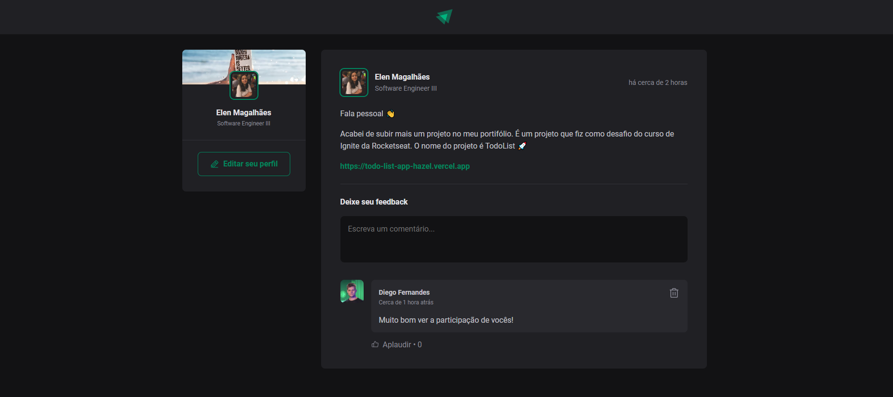

<h1 align="center"> Ignite Feed </h1>

<p align="center">
Desafio desenvolvido em conjunto com a Rocketseat com a finalidade de aprimorar os fundamentos do ReactJS.
</p>

<p align="center">
  <a href="#-tecnologias">Tecnologias</a>&nbsp;&nbsp;&nbsp;|&nbsp;&nbsp;&nbsp;
  <a href="#-projeto">Projeto</a>&nbsp;&nbsp;&nbsp;|&nbsp;&nbsp;&nbsp;
  <a href="#-layout">Layout</a>&nbsp;&nbsp;&nbsp;|&nbsp;&nbsp;&nbsp;
  <a href="#memo-licença">Licença</a>
</p>

<p align="center"> 
  
  <a href="https://rocketseat.com.br">
    
  </a>
  
  <a href="https://github.com/elenmagalhaes/ignite-feed-web/stargazers">
    
  </a>
</p>

<br>

<p align="center">
  
</p>

## 🚀 Tecnologias

Esse projeto foi desenvolvido com as seguintes tecnologias:

- [React](https://pt-br.reactjs.org)
- [CSSModules](https://github.com/css-modules/css-modules)
- [ViteJs](https://vitejs.dev)

## 💻 Projeto

O projeto é um feed de rede social para postar e comentar publicações. Tem como objetivo aprimorar conceitos básicos do React.

## 🔖 Layout

A aplicação ainda não está hospedada em produção, mas é possível visualizá-la em ambiente local, clonando o projeto e executando os seguintes comandos.

```
yarn / npm
```

```
yarn run dev / npm run dev
```

## :memo: Licença

Esse projeto está sob a licença MIT.

---

Desenvolvido por Elen Magalhães
